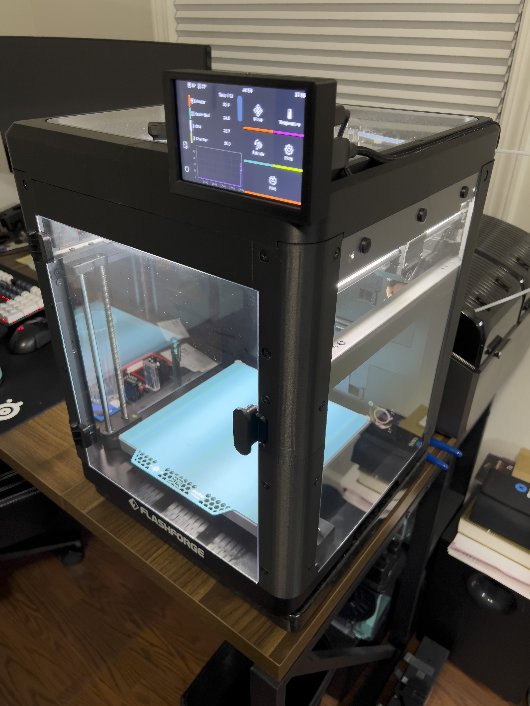
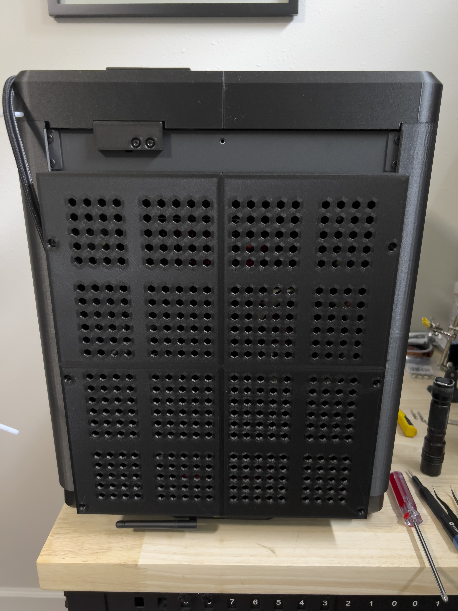

# Enclosure / PSU Section  

**Parts Needed:**  
-8x 12x3mm magnets for the enclosure top.  
-6x 36mm M4 screws screws for the back housing/cover assembly.  
-3ft/1m HDMI to Micro HDMI & USB-A to USB-C cables for the display.  
-2x 40mm 12v Fans for enclosure ventilation.  

I have included an STL for the replacement front cover for the Meanwell LRS-450 adding support for a 92mm fan. The stock fan runs at 12v.  
**I will not be including instructions or pictures for modification of the PSU for liability reasons. Please be careful.**  

For the overall enclosure for the printer, just use the original Flashforge enclosure kit minus the top. The parts included in the guide are for the top cover and the rear cover (with extensions). The rear covers and extensions will add roughly 40mm of depth to your printer.  

**Front Screen:**  
The back cover of the BTT Touch 5 is mounted to the top of the enclosure ***first***.  
The screen itself is pressure fit into the front cover, then you slide the front cover over the rear cover and secure with 2 M2 coarse-threaded screws.  

**Back Housing Mods:**  
  
  

The LRS-450 shares the same mount as the LRS-350 (and the original power supply), so no modifications are needed on the mount holes themselves.  
The entire shroud for the top enclosure fan will need to be cut flush (or close to flush) for the new board to fit.  
A lot of this will be trial and error, test fit, remove more material, test fit again, etc.  

**Top Housing:**  
I have no in-progress shots while making this, but it should be pretty self-explanatory. Print the parts, place on a large, level surface, glue together with your choice of adhesive. I generally glue the magnets into the slots after the top is glued into one piece.  
There are 2 spots for M3 thread inserts for the screen mount, make sure these are slightly recessed so the screen housing can mount flush to the top assembly. The USB and HDMI cables should slot nicely into the groove in the right side of the top assembly.  

  

**Rear Extensions and Cover:**  
The rear extension pieces are pressure fit into each other, I placed double sided tape on the inside edge, then used the M4 screws to align the extension pieces. This will allow you to install/remove the rear cover without struggling to line multiple things up.  
The top-left extension piece has a groove cut into it to allow the USB and HDMI cables from the screen to pass through.  

The rear covers are held together with 8 total M3x10 coarse thread screws. They have tabs in the corners to help line the assemblies up.  
  
