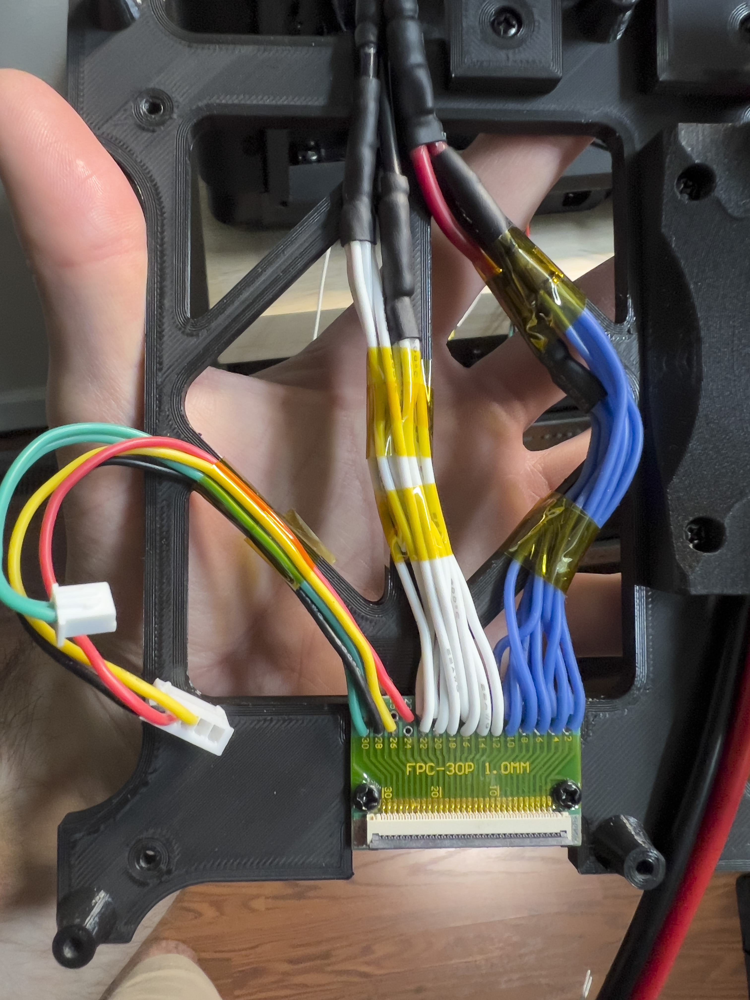

# Mainboard Section  

**Document of Schematics/Installation/Configuration** [BTT Wiki](https://global.bttwiki.com/M8P-V2_0.html)  

Parts Required:  

-FPC 30p 1mm PCB (For adapting the AD5M bed ribbon to interface with the new mainboard) [From Amazon](https://a.co/d/09iN6a9x)  
-Mainboard Dependent - 3 Stepper Motor Drivers (I used TMC2240 with my Manta M8P v2) [From Amazon](https://a.co/d/0ccSFjxs)   
-A large external MOSFET for the bed heater [From Amazon](https://a.co/d/080Fl4P3)  
-A slim 140mm fan [From Amazon](https://a.co/d/0aiYGzja)  

**MOSFET Section:**  
The Manta M8P and many other mainboard come with on-board MOSFETS to drive a bed heater. The M8P is rated to ~10 Amps, which is pretty much exactly the power rating of the stock AD5M bed heater (250w).  

I would *strongly* suggest that you include an external MOSFET like I listed above. It's stupid-overkill regarding power rating, but I would much rather err on the side of caution.  

Follow the pinouts of the respective external MOSFET that you purchase, they should be pretty self-explanatory. 2 terminals for main power in, 2 terminals for bed power out, 2 terminals for bed control (coming from the mainboard).  

**Bed Electrical Connection:**  
  

Above includes the pinouts for the FPC ribbon cable for the bed, as well as the pinouts for the Z-endstop and filament runout sensors.  

  

Above shows the wiring that I created to adapt to the FPC ribbon. Each one of the heater wires starts as a 22 gauge wire, these are then divided into groups of 5 and 6 and crimped into 2 separate 16 gauge wires. The two 16 gauge wires are crimped into a single 12 gauge wire.  

So for *EACH* pole of the heater, there will be 11x 22 gauge wires spliced into 2x 16 gauge wires spliced into 1x 12 gauge wire.  

**M8P Diagram:**  
  

>[!NOTE]
>I did not use the filament sensor during my conversion of the printer. You should be able to wire it to any of the endstop connections and configure in your printer configuration.  
>You may elect to add additional thermistors since there are extra slots with the Manta M8P, I used thermistors on all of my stepper motors and added a chamber temperature themistor as well.

The chamber fans that I used (40mm Noctua) and all of the other fans are 12v, so you will need to select the voltages for the fans using their respective jumpers. Follow the manual for the mainboard.  

For the chamber fans, I used 2 pin JST-XH to 4 pin fan adapters, so you will lose PWM control and tachometer. Voltage control will still work to control fan speeds.  

You can re-use the stock X, Y and Z stepper motor wiring, the pinouts do not change.  

**Assembly Order:**  
1: Attech MOSFET bracket to mainboard bracket (2x M3 coarse screws)  
2: Attach FPC ribbon PCB to mainboard bracket (2x M3 coarse screws)  
3: Secure mainboard bracket assembly to the printer back housing (4x M3 coarse screws)  
4: Connect bed ribbon to FPC connector  
5: Secure M8P mainboard to mainboard bracket (4x M3 coarse screws)  
6: Connect all wiring (tweezers will come in handy grabbing the wires on the left edge of the mainboard, space is limited)  
