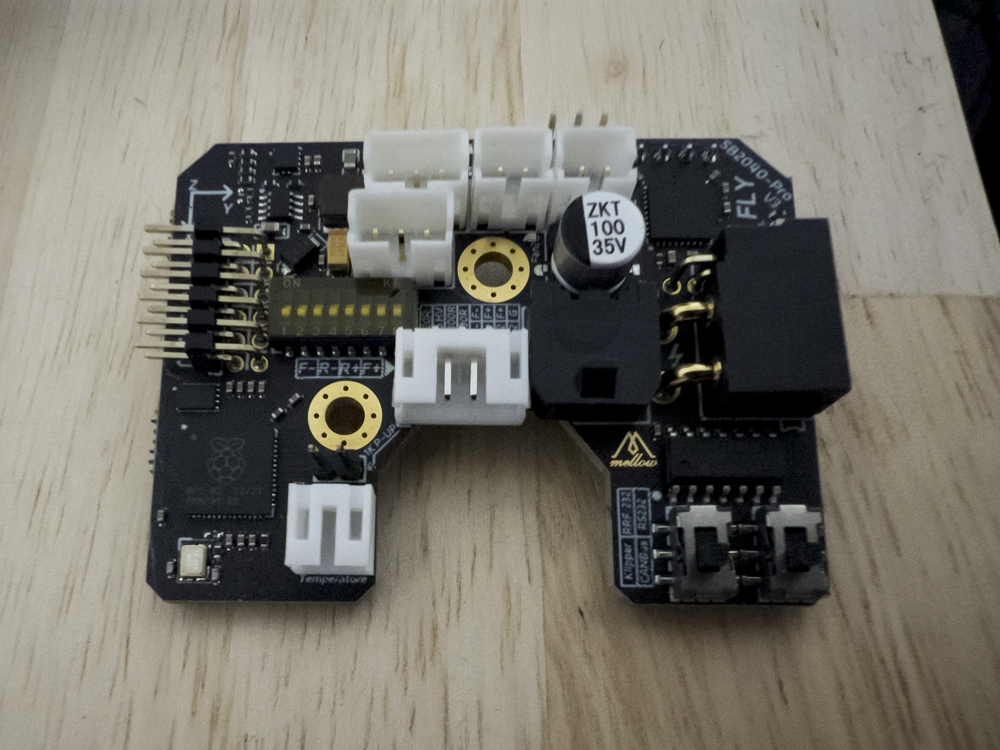
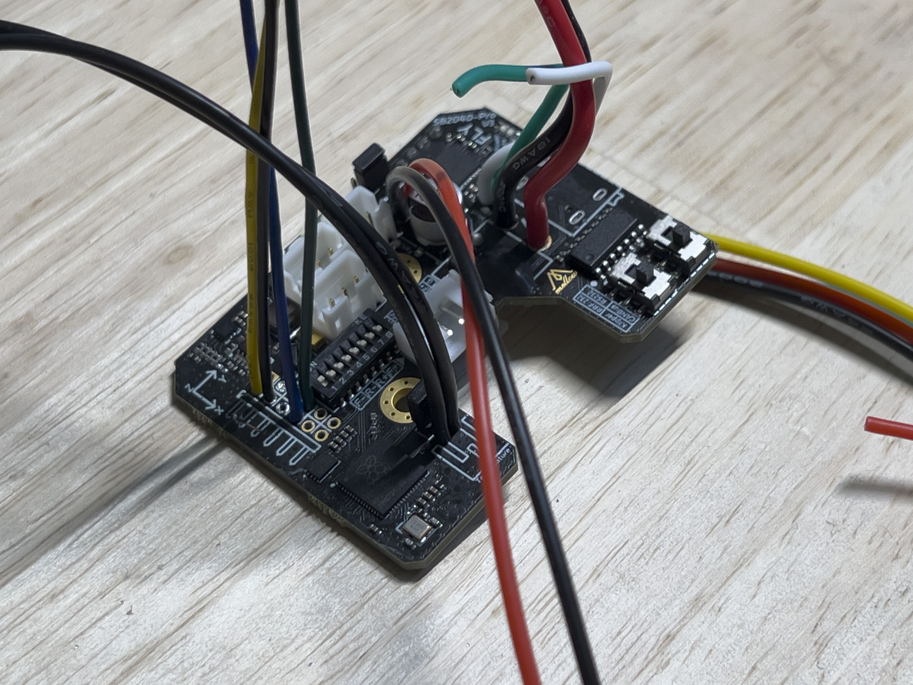
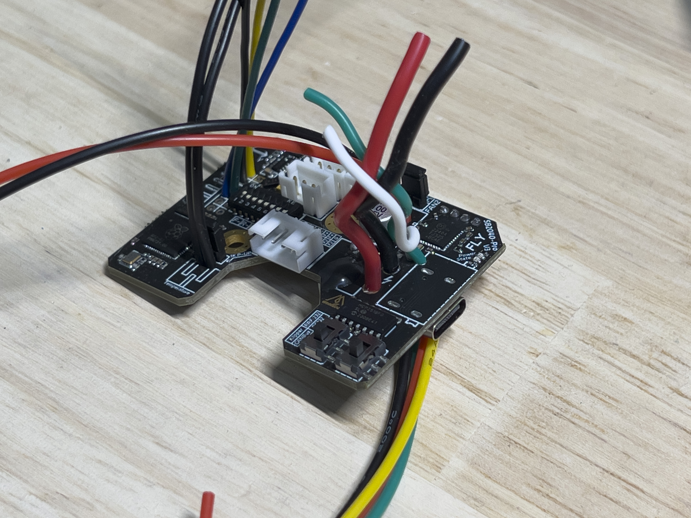
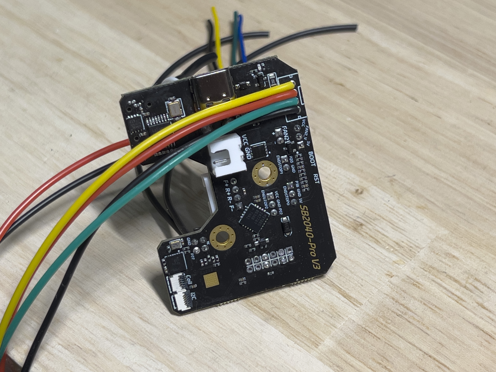
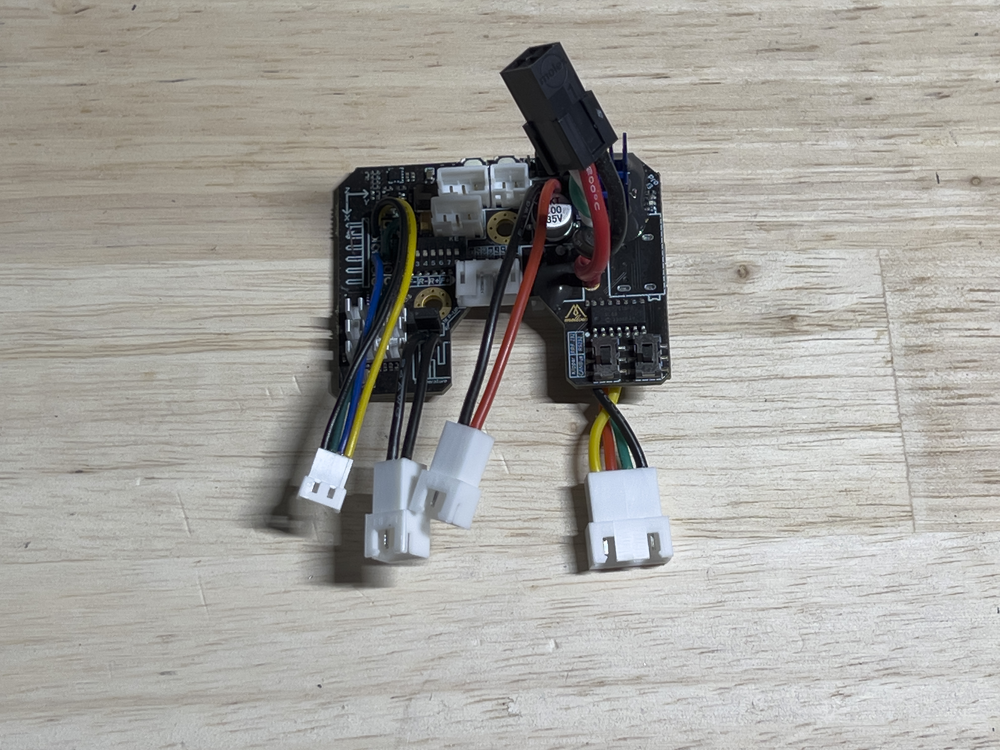
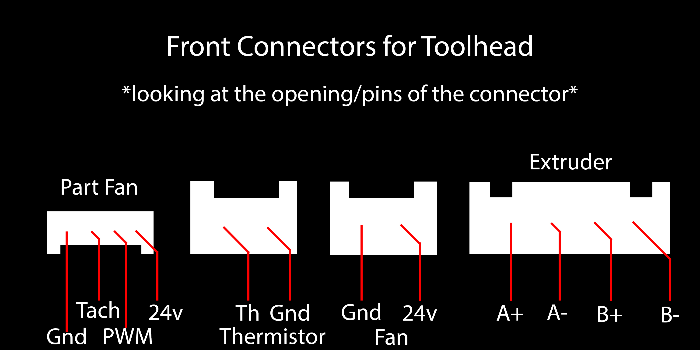
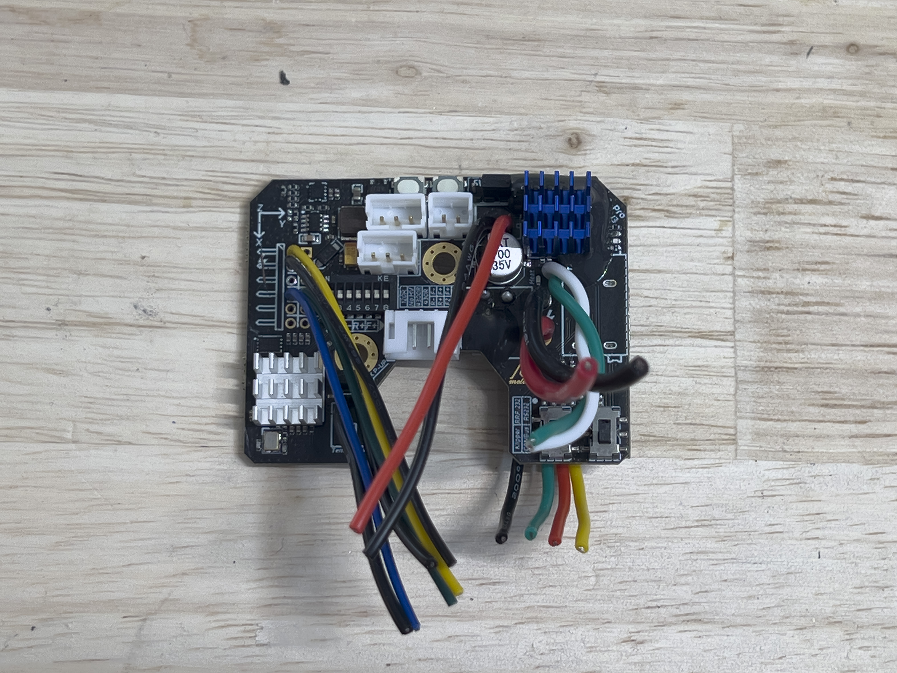

# Toolhead Section

Specific Parts Needed  

-2X Honeywell SM453R Omnipolar Magnetic Switch (T092-3) [From DigiKey](https://www.digikey.com/short/qbd3v8pj)  
-A right angle 2 pin JST-XH connector for the hotend connection.  
-A set of '2x2' Molex Microfit 3.0 connectors (buy a couple so you have extras) [From Amazon](https://a.co/d/008s7Y0V)  

> [!NOTE]
> Make sure you purchase the correct Molex Microfit 3.0 pins, a lot of listings support 20-24 gauge wiring, you must purchase 18 gauge specific pins for the power connections.

The XT30 power connector, side pin header for the secondary board, thermistor connector, hotend connector, fan header and extruder motor connectors will need to be removed/desoldered. If you have a desoldering pump, it will make your life easier when you install the replacement connectors and wiring.  

**Before:**  
  
**After:**  
  

> [!NOTE]
> In my case, using a small set of flush cutters to cut the XT30 pins individually helped with desoldering. The rest of the pins didn't give me many issues.  

**SB2040 Pinout:**  
  

**SB2040 Wiring:**  
   
   

> [!NOTE]
> I used 18 gauge wiring for the main power to the Molex Microfit 3.0 and 24 gauge wiring for the rest of the circuits.  
> I would recommend smaller wiring for the part fan connector (I disassembled some PC fan extension cables), the JST MX connectors/pins are ***TINY.***

**Toolhead Connectors:**  
  

I would strongly recommend upgrading the SB2040's included driver heatsink, I used a 'stick-on' 9x9x12mm heatsink and potted it to assist with vibration resistance. I added a small heatsink to the Raspberry Pi controller as well.  
  
