# Toolhead Section  

**Document of Schematics/Installation/Configuration** [Fly Wiki](https://mellow.klipper.cn/en/docs/category/fly-sb2040-pro-v3)  

Specific Parts Needed  

-2X Honeywell SM453R Omnipolar Magnetic Switch (T092-3) [From DigiKey](https://www.digikey.com/short/qbd3v8pj) (I would buy extra just in case)  
-A right angle 2 pin JST-XH connector for the hotend connection.  
-A set of '2x2' Molex Microfit 3.0 connectors (buy a couple so you have extras) [From Amazon](https://a.co/d/008s7Y0V)  
-A set of 9x9x12 Stick on Heatsinks for the Motor Driver [From Amazon](https://a.co/d/09exRvM4)  
-A 30x15mm 24v fan, 2 wire.  
-A straight 2 pin JST-XH connector for the hotend thermistor (you need to change the X1 thermistor connector to JST-XH)  
-Some 1/4" PET braided sleeving to protect the wiring harness [From Amazon](https://a.co/d/0aQ7BoMF)  

> [!NOTE]
> Make sure you purchase the correct Molex Microfit 3.0 pins, a lot of listings support 20-24 gauge wiring, you must purchase 18 gauge specific pins for the power connections.

The XT30 power connector, side pin header for the secondary board, thermistor connector, hotend connector, fan header and extruder motor connectors will need to be removed/desoldered. If you have a desoldering pump, it will make your life easier when you install the replacement connectors and wiring.  

**Before:**  
  
**After:**  
  

> [!NOTE]
> In my case, using a small set of flush cutters to cut the XT30 pins individually helped with desoldering. The rest of the pins didn't give me many issues.  

**SB2040 Pinout:**  
  

**SB2040 Wiring:**  
   
   

> [!NOTE]
> I used 18 gauge wiring for the main power to the Molex Microfit 3.0 and 24 gauge wiring for the rest of the circuits.  
> I would recommend smaller wiring for the part fan connector (I disassembled some PC fan extension cables), the JST MX connectors/pins are ***TINY.***

**Toolhead Connectors:**  
  

I would strongly recommend upgrading the SB2040's included driver heatsink, I used a 'stick-on' 9x9x12mm heatsink and potted it to assist with vibration resistance. I added a small heatsink to the Raspberry Pi controller as well.  
  

**Toolhead Body:**  
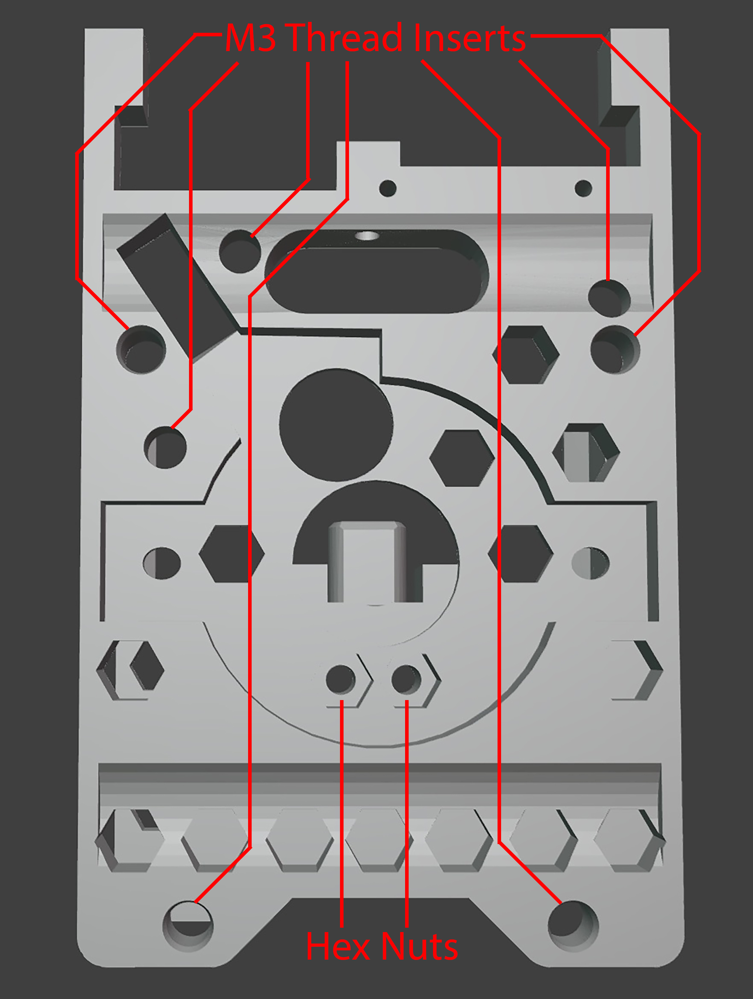  
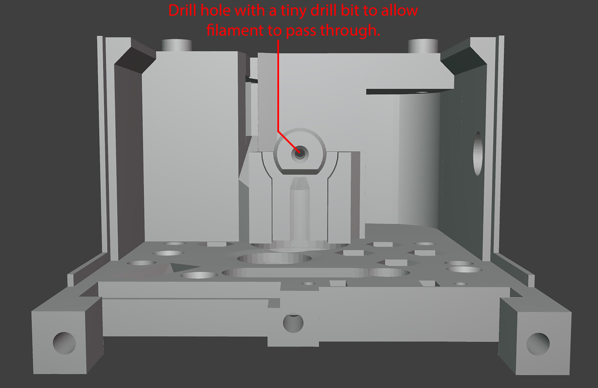  

**Toolhead MR Sensors:**  
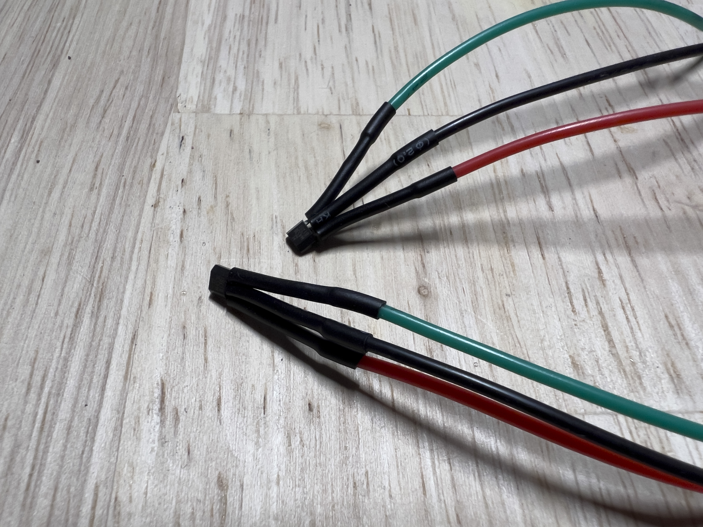 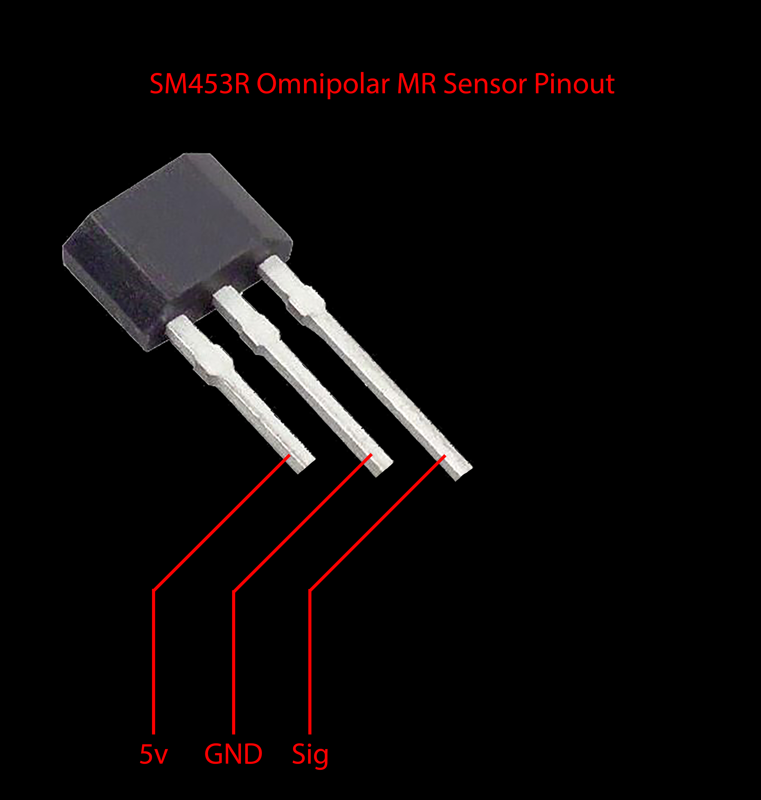  

> [!NOTE]
> When inserting the MR sensors into the toolhead cap, make sure they are completely bottomed out, the top of the sensor (opposite of the leads) is inserted first, the holes should be a snug fit. Only epoxy the areas surrounding the MR sensor to hold it in place. Epoxy ***should not*** contact the sensing faces.
> 
> In my case, it was easiest to trim the leads to ~1/2 the original length, solder the wires, heatshrink the connections, then bend everything to a 90 degree angle. The rounded face of the sensor should face the bottom on the Y endstop, towards the front on the X endstop.  

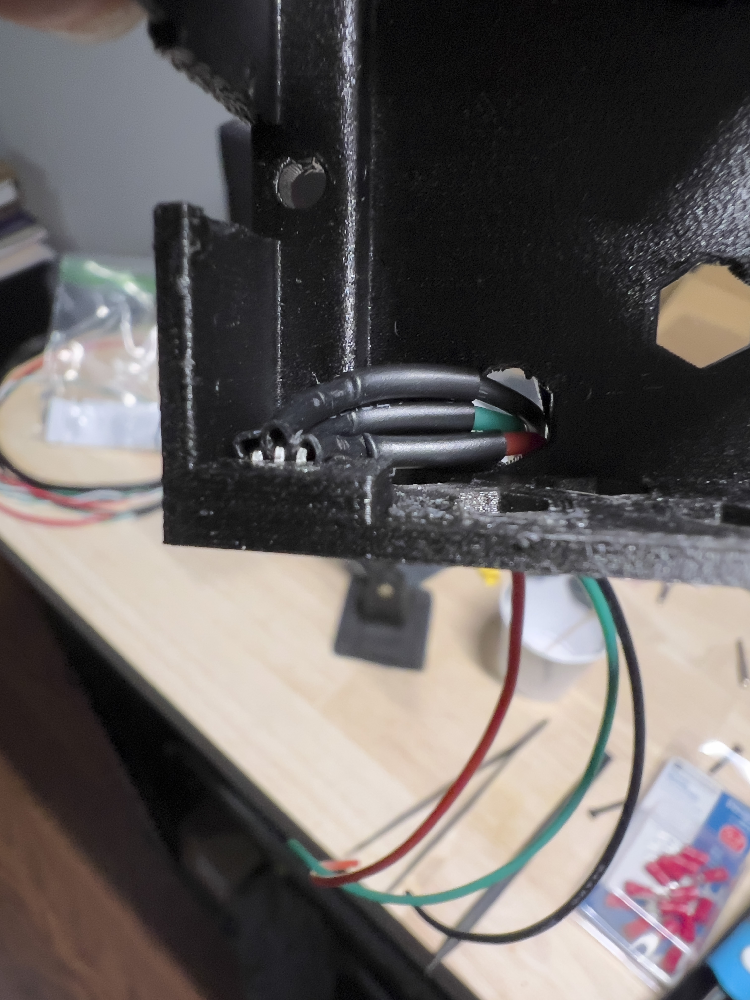 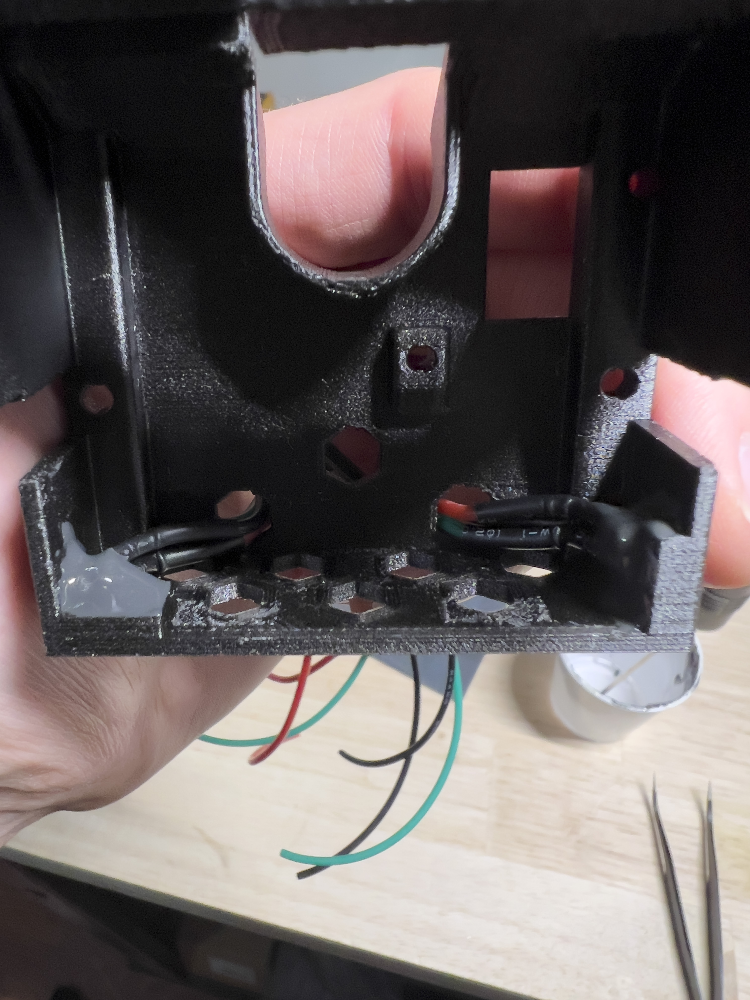  

The MR sensors will be ***sharing a 5v pin*** from the 3pin endstop connector. The Y endstop sensor will utilize the 3pin endstop connector, the X endstop sensor will utilize the 2pin endstop connector.  
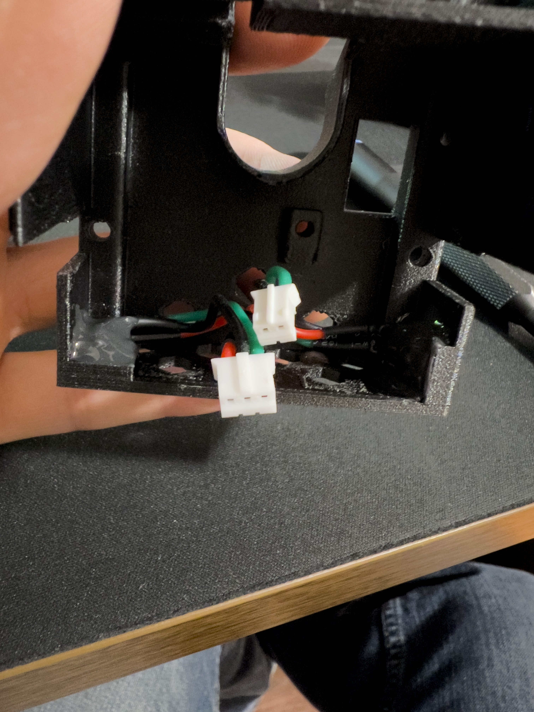  

**Original Extruder Modifications:**  
You will need to cut off the original 30x10 fan mounts from the stock extruder and remove the top tabs that hold the original fan wiring. This will make the top flush and give more room around the extruder.  

**Toolhead Harness:**  
I intentionally made my harness long so I could shorten later. My harness was a little over 1 meter long when completed.  
It will be 2x 18 gauge power wires and 2x 24 gauge CAN wires. Make sure you twist the 24 gauge wires to avoid interference.  
I used a braided PET sleeve to cover and protect the wires from chafing. Heat shrink over the end of the sleeving near the toolhead connector (where the clamp is).  

**Toolhead Assembly Order:**  

1: Toolhead body prep, insert heat-set inserts and hex nuts for the hotend. Drill out 'tube' between extruder and hotend with a tiny drill bit.  
2: Install hotend. Apply blue threadlocker to the M3 screws. I make sure the hotend is bottomed out while torquing the screws.  
3: Install 30x15 hotend fan, intake from the outside blowing air toward the hotend.  
4: Install extruder motor to the toolhead assembly, route wiring through the rectangular hole.  
5: Install extruder assembly and tighten the 3 screws.  
6: Install printed part "board mount" that is located just above the extruder. You may wish to use M2 coarse screws to clamp in place, they are recommended but not absolutely neccessary.  
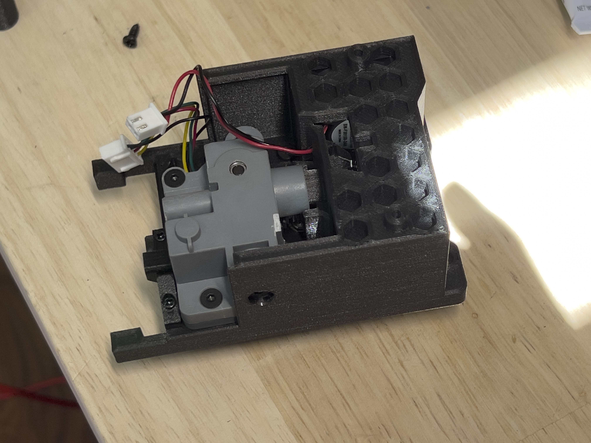  
7: Install SB2040 board using 2 coarse M3 screws. Plug in hotend heater connection.  
8: Install the toolhead cap, plug in the MR sensors, then fiddle with the connectors to get them routed correctly. The 2x2 4pin Molex Microfit main connection exits the cap on the top rectangular hole. The 4 other connectors should route to the front and 'clip' in place.  
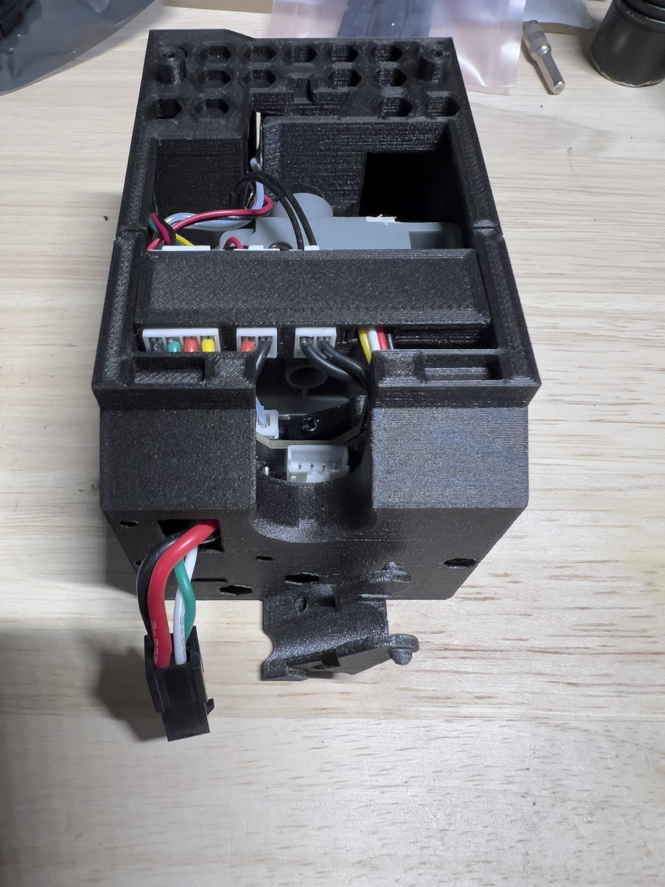  
9: Install front connector cover over the 4 different JST connections. Install the extruder guide (slide over the top of the extruder, it has a slot to interface correctly).  
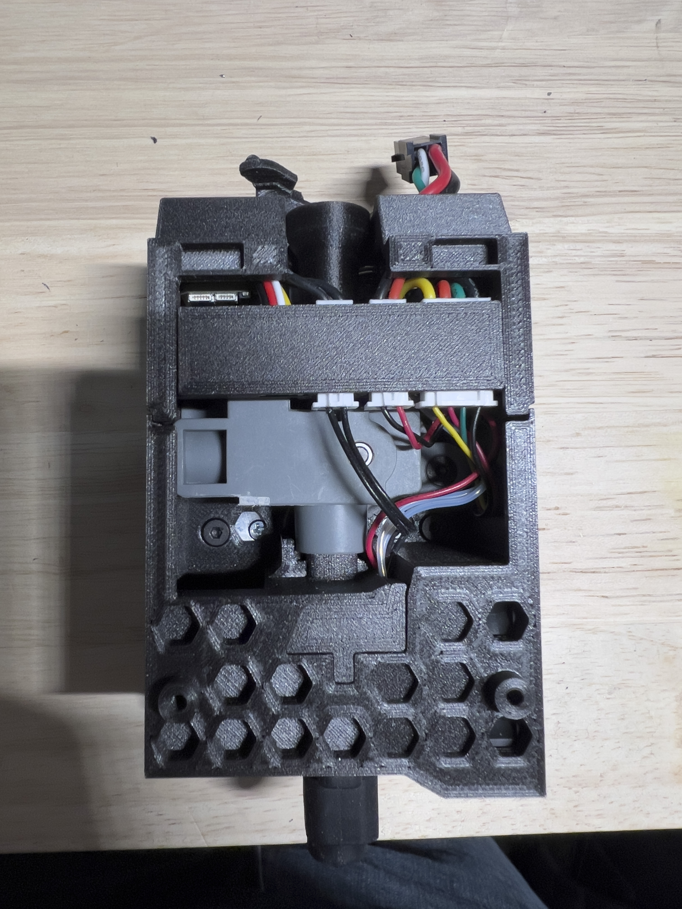  
10: Plug in extruder motor, hotend fan and hotend thermistor connections.  
11: Install printed part "partfan gap filler" to part fan assembly, it should be a snug fit.  
12: Install part fan to toolhead assembly, route wiring so it doesn't get pinched. Secure with M3x16 coarse screws.  
13: Install/connect main wiring harness to toolhead, attach strain relief connection and tighten screws with the wiring in the correct location.  
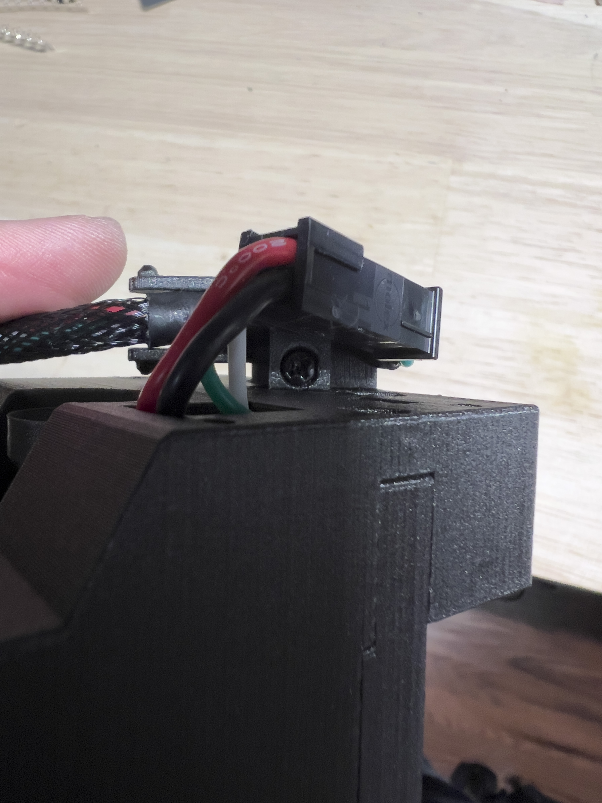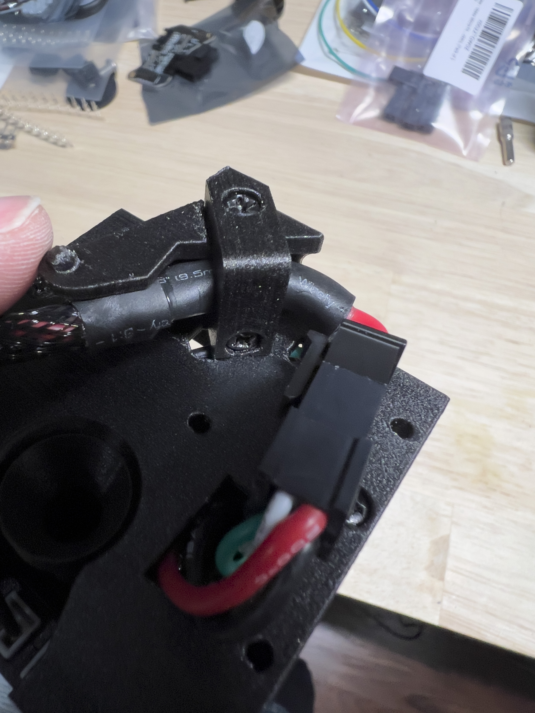  
14: Install printed part "molex housing" with 3 M3x8 coarse screws, the Molex Microfit housing should have the release tab facing the center of the toolhead cap, it will only install one way.  
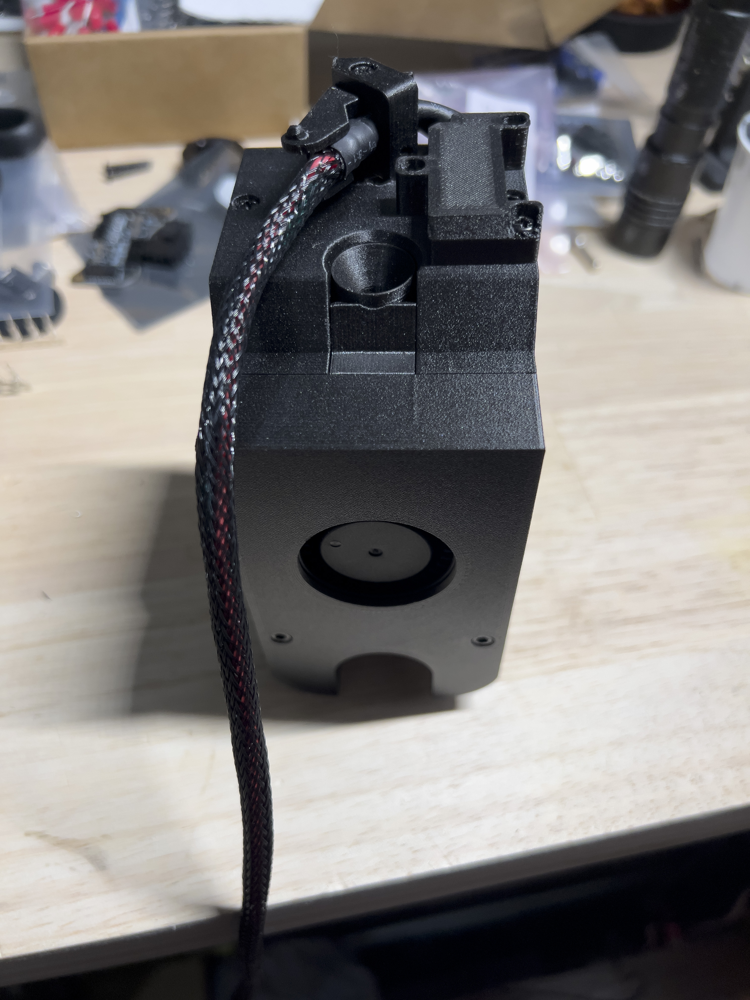  
The main assembly should be complete, route wiring harness through your drag chain assembly and back to the grommet on the printer.  
